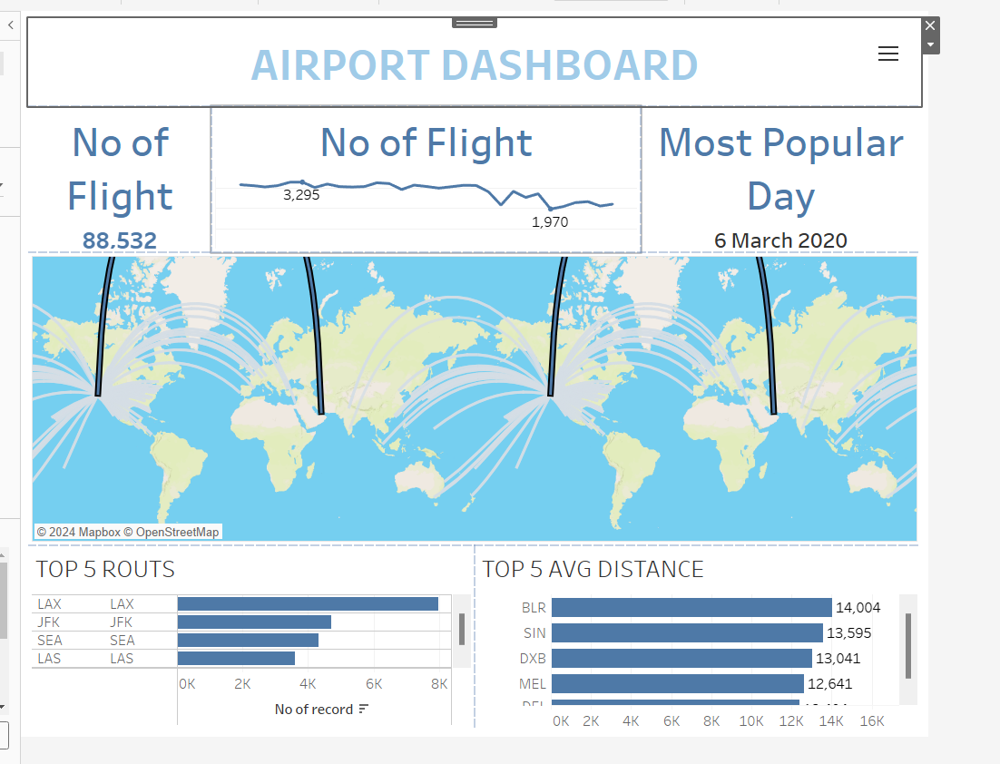
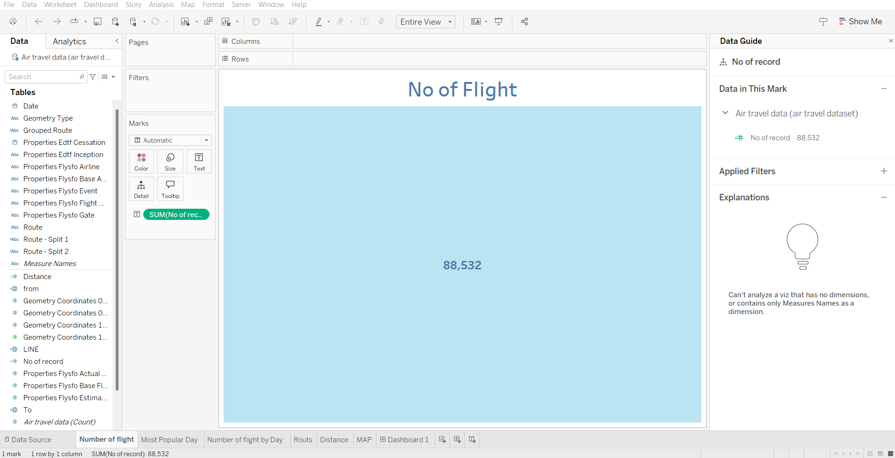
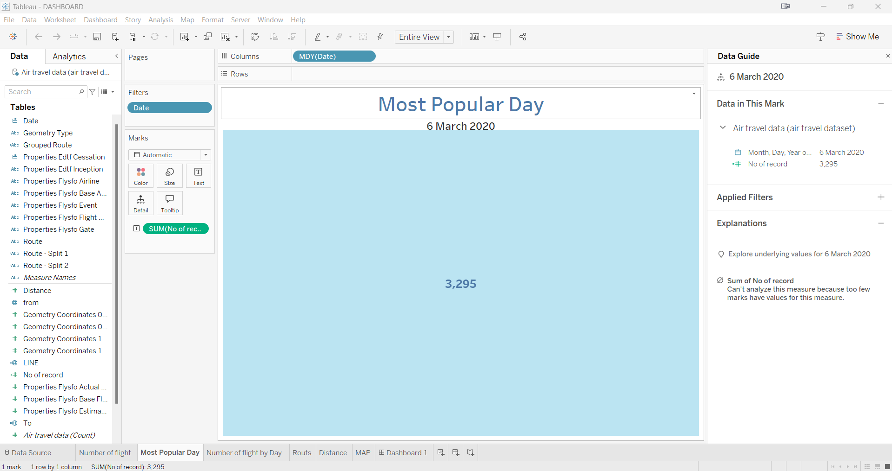
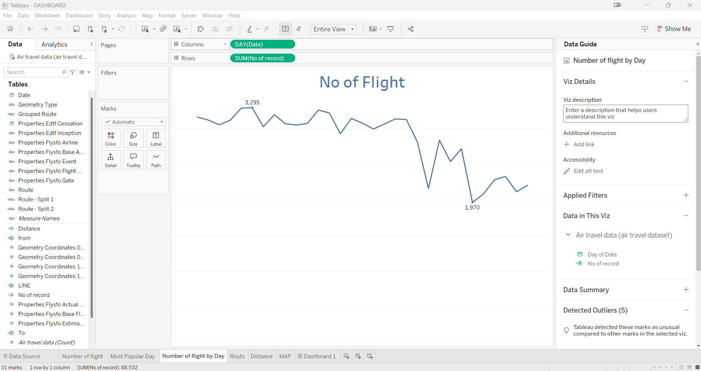
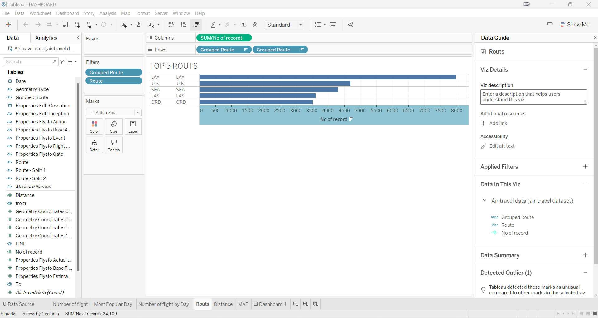

Report: Airport Dashboard

Introduction
The Airport Dashboard is a data-driven visualization that provides insights into flight operations, trends, and performance metrics at a glance. It integrates key information such as the total number of flights, the most popular day for travel, top flight routes, and average distances of routes. This dashboard serves as a powerful tool for stakeholders in the aviation industry, such as airport authorities, airline managers, and analysts, to monitor and optimize operational efficiency, passenger satisfaction, and resource allocation.

________________________________________

---------------------------------------
## 📊 Final Output

---------------------------------------
Scope of the Analysis
The Airport Dashboard focuses on the following aspects:
1.	Flight Volume Analysis: Displays the total number of flights over time and identifies fluctuations or patterns in traffic.
2.	Most Popular Day: Highlights the busiest day for flight operations, helping airports prepare for peak periods.
3.	Top Routes: Provides insight into the most frequent flight routes, helping airlines and airports focus on high-demand connections.
4.	Average Flight Distance: Offers a detailed view of the routes with the highest average travel distances, supporting long-haul flight planning and fuel optimization.
5.	Visual Representation: A world map illustrates the connectivity of global routes, enabling an easy understanding of geographical distribution.
This dashboard enables data-driven decision-making, resource planning, and operational improvements within the aviation industry.

________________________________________
Drawbacks or Limitations of the Existing System
1.	Lack of Real-Time Data: The current dashboard does not integrate live data, limiting its ability to adapt to real-time changes in flight operations.
2.	Limited Predictive Analytics: The system lacks predictive capabilities to forecast future trends, such as changes in passenger demand or weather disruptions.
3.	No Passenger Insights: It focuses solely on flight data and does not provide insights into passenger demographics or satisfaction levels.
4.	Static Reporting: The visualizations are static, and users cannot dynamically drill down into specific data points for deeper analysis.
5.	Global Context: The dashboard does not include environmental impact metrics, such as CO₂ emissions, which are increasingly important in aviation reporting.

________________________________________
Future Improvements
To enhance the functionality and relevance of the dashboard, the following steps can be taken:
1.	Real-Time Integration: Connect the dashboard to live data feeds to monitor ongoing flight operations and delays.
2.	Predictive Analytics: Implement machine learning models to forecast trends, peak times, and potential disruptions.
3.	Passenger Data Integration: Add passenger data such as age groups, travel preferences, and feedback to enhance customer service strategies.
4.	Interactive Features: Enable users to filter data by date range, region, or airline for more customized analysis.
5.	Sustainability Metrics: Include metrics related to environmental impact, such as fuel consumption and carbon emissions, to align with global sustainability goals.
6.	Mobile Accessibility: Develop a mobile-friendly version of the dashboard for greater accessibility on the go.

  
   
Chart:
o	A line graph displays the number of flights per day.
o	Peaks and dips in the graph indicate changes in flight activity.
o	For example, the highest value (3,295 flights) and lowest value (1,970 flights) are highlighted.
Filters and Fields:
o	The data is grouped by the DAY(Date) field on the X-axis.
o	The Y-axis represents the SUM(No of record), which counts the flights for each day.
Data Guide Panel:
o	Viz Details: A section to describe the visualization.
o	Applied Filters: Shows any filters applied to the data (none visible in this image).
o	Data in This Viz: Indicates the dataset and specific fields used (Day of Date and No of record).
o	Detected Outliers: Tableau has detected five outliers in the data (days with unusual flight counts).
Data Panel (Left):
o	Displays available fields from the dataset.
o	Includes fields like Date, Route, Distance, and others.
Tabs (Bottom):
o	Multiple worksheets are present, such as Number of flight by Day, Routes, and MAP.
   
Map Visualization:
•	The map shows flight routes connecting various global locations.
•	Each arc represents a route between two locations, indicating direct flights or connections.
Marks Panel:
•	COLLECT(LINE): Represents the lines or arcs connecting the routes on the map.
•	Route: Likely the field containing information about flight paths.
•	SUM(Distance): Indicates the total distance covered by each route.
Columns and Rows:
•	Longitude (generated) and Latitude (generated) are used to position routes geographically.
Data Guide Panel:
•	Viz Details: Provides space for a description of the map.
•	Data in This Viz: Specifies the fields used for the visualization (Route, Distance, and LINE).
•	No Outlier Marks Found: Suggests no anomalies were detected in the data.
Data Panel (Left):
•	Contains fields related to air travel data, such as Date, Route, Distance, and others.

Conclusion
The Airport Dashboard provides valuable insights into flight operations, offering a comprehensive view of key metrics such as flight volume, popular routes, and average distances. While the current system serves as an effective monitoring tool, integrating advanced analytics, real-time data, and sustainability metrics can significantly expand its utility. These enhancements would enable aviation stakeholders to make more informed decisions, optimize resource allocation, and improve both operational efficiency and passenger experience. Through continued development, this project can become a vital resource for the evolving needs of the aviation industry.

Linkedln link - https://www.linkedin.com/posts/abhiraj-singh-chouhan-19574a205_dashboard-excel-analysis-activity-7261806195085049858-Sx-5?utm_source=share&utm_medium=member_desktop

Github link - https://github.com/ajokbyy/Airport-Dashboard-in-tableau-2024.git

-------------------------------------------------------***-------------------------------------------------------------
